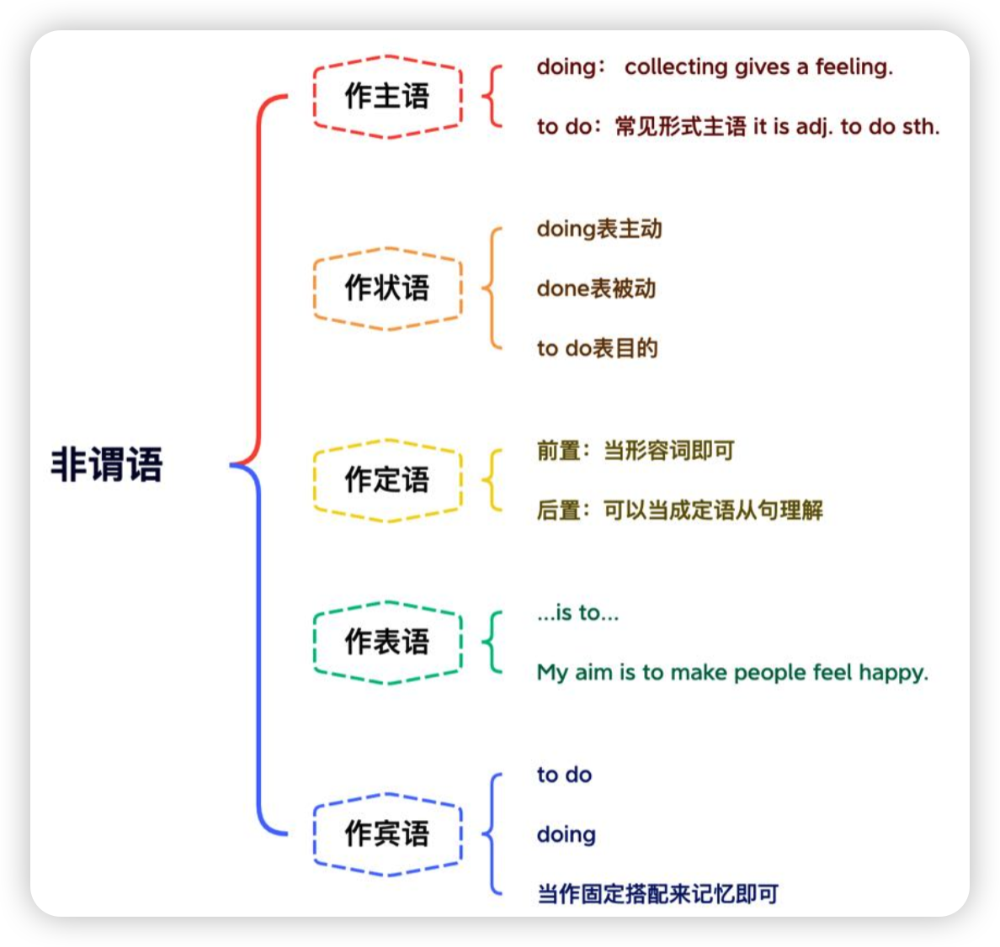
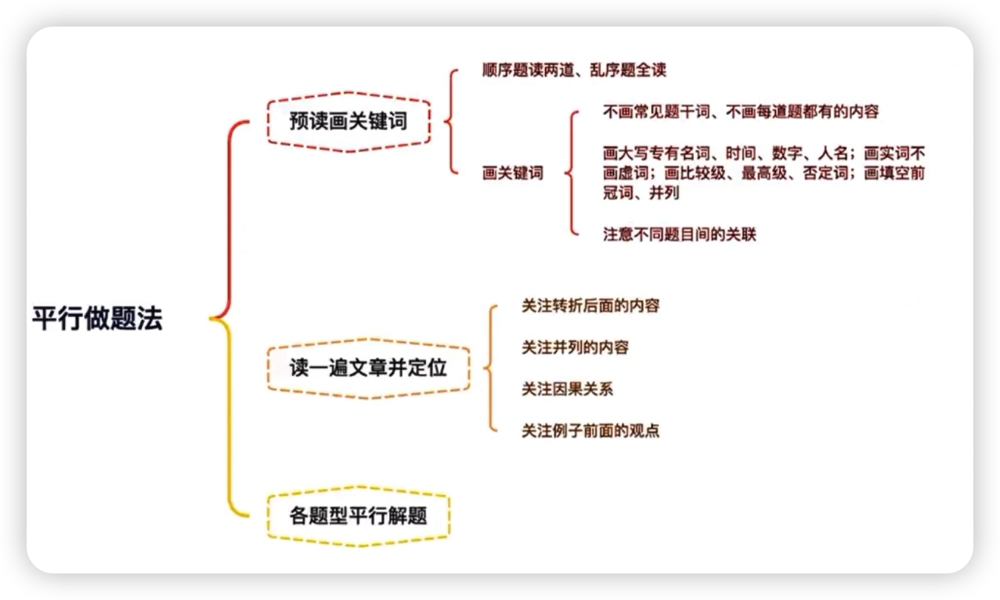
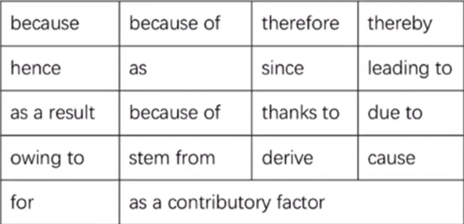
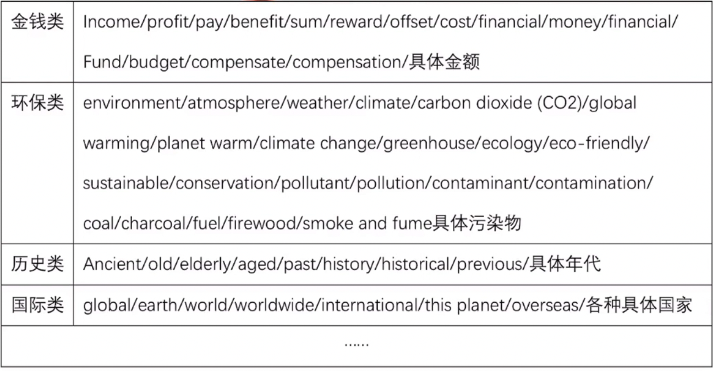

# 雅思阅读
词汇 + 语法 + 解题技巧 + 阅读量
# 语法
## 从句

## 非谓语 

# 核心：同义替换
- 同义词
- 同义短语
- 同义句子（主动被动）
# 题型分类
## 1. 顺序题
题型内部的出题顺序  
（一般为顺序）
判断
填空 图形填空 选词填空 回答问题
单选
句子匹配
## 2. 乱序题
段落匹配 Which paragraph contains
人名/学说/国家/公司等信息匹配
段落大意 Heading
## 3. 特殊题
选文章标题 Title/副标题 Subtitle
多选 
# 平行做题法：三步走
预读题画关键词；
带着问题去读文章定位，文章只读一遍、各题型平行
做题；
对比答案句和题目进行解题
 
# 1. 预读题目圈关键词
## 做题顺序
### 顺序题 
保持有两题已经预读 
### 乱序题
预读所有题目，画关键词 
### 特殊题
选标题：读完全文再做；
多选题：
1. 预读题目
2. 题目提供信息足够定位答案时，选项后面读；否则，预读选项。
## 画关键词
### 不画什么？
主旨词、高频词不画。
- 不画常见题干词，reference、account、mention、refer 无实际意义
- 不画每道题都有的内容、全文反复出现的词
### 画什么？
- 画时间、数字、大写专有名词、人名等
- 画有具体内容的实词 content words、不画没有具体内容的虚词 function words --- of、it、is、does
- 画比较级、最高级、否定词（判断题）
- 画填空前的冠词、并列，可能有对应 
### 注意不同题目之间的关联
逻辑词
### 总结
预读题目了解每道题问的是什么问题，抓句子重点内容
# 2. 读文章定位关键词或其同义替换改写，始终记得自己接下来要做题有哪些 

读文章时自动圈出
## 转折词
however/but/although/though/
while/whereas/despite/yet/
notwithstanding/nonetheless/nevertheless/
albeit
等转折词后是重点
## 并列词 
and/or/also/as well as/
both ...and.../not only...but also.../
in addition/besides/along with/
one the hand... on the other hand.../
not ...but.../
either...or.../neither...nor.../
moreover/one...another/
分号；等，并列内容同等重要；
并列关系是填空题、多选题解题关键。
## 因果关联词
because/because of/
therefore/thereby/
hence/as/since/
leading to/as a result/
due to/thanks to/owing to/
cause/caused by/ 
stem from/derive/
for/as a contributory factor/
等，分清因果。
## 举例子
for example/for instance/
...is a good example/such as/ 
等，  
“观点 + 举例子“
例子前一般为重要观点；
例子可能对应 which paragraph contain 题中的 an example of...。
## to+动词
to+动词表目的， “为了/来”，经常对应
aim、goal、objective、purpose等
## 代词
it/this/that/they 等具体代指什么，就去前一句找。
# 3. 解题

## 判断题 
### TRUE/FALSE/NOT GIVEN 底层逻辑 
#### True:agree---一致、相符、一个意思
1. 同义替换+意思一致 （占 True 绝多数情况）
2. 简单的概括总结（可能跨段落）
#### False:contradict---驳斥、矛盾、对立、意思完全相反、不可能同时成立、不可能共存
1. 反义词  
2. 直接否定
It is now clear/has proven != not clear/no proof/ no evidence
3. 简单的概括总结，意思相反
4. 情况唯一且不相符 
a/one/the only != some 
majority/most != all/every
#### Not Given:no information---没有提及、无中生有、讨论不在一个纬度（讨论的不是一回事）、可能同时成立（可能共存）、题目可能真也可能假
 1. 内容没有提及
几个特例：the first/only/major/most 最高级原文中没有提及
反例：没有最高级，但是有 the most...=more than all other, 就是True。
2. 提到了内容，但是其中的关系（比较、因果等）未提及
比较未提及： 
原文：A and B
题目：A is more...than B (横向、纵向比较)

反例：并不是比较就一定是Not Given，比如有同义替换改写。
3. 不相符但情况并不唯一
### TRUE/FALSE/NOT GIVEN 解题思路梳理
#### 信息不相符时，判断是否有唯一性
反义词 = FALSE
不相符
- 唯一性 = FALSE
- 不唯一性 = NOT GIVEN
#### 搞清楚两个词是不是一个逻辑、一个维度、一件事
谨防“偷换概念”
#### 看到The first/the only/the best/the biggest/the most，在其他内容确定的前提下，要谨慎去找有没有提及相关信息（顺序/数量/最高级比较）
没有提及相关信息（顺序/数量/最高级比较）= NG
提及了相关信息（顺序/数量/最高级比较）
- 且相符 = T
- 且不相符 = F  
the first = earlier than any other .../earlier than all other ...
the most K = more K than any other .../more K than all other... 
#### 范围变化（概括和具体、大类和细分举例）是单向的同义替换
文：概括 （我吃了水果）
题：具体  （我吃了苹果）=> NG

文：具体 （我吃了苹果）
题：概括 （我吃了水果）=> T
#### 并列关系里单拿出来一个是没有问题的，但要注意方向
文：A and B
题目：A => T

文：A
题目：A and B => NG
#### 过程也重要
文：先up后down
题：up了 => T
#### 要学会自己举身边的例子
逻辑迁移
## 填空题
一般是顺序题，偶见两个颠倒位置；
填空题是细节题，考察细节答案句对应。
### 填空题分类
#### 总结填空
集中在一段或者遍布在几段
#### 表格填空 
集中在一段或者遍布在几段
#### 句子填空
一般遍布在几段
#### 选词填空
集中在一段或者遍布在几段
选项是同义替换或者原词
#### 图片填空
答案相对集中
#### 回答句子
当成普通填空来做，
集中在一段或者遍布在几段
#### 总结：手写填空和选词填空
选词填空注意同义替换
注意字数限制，在满足字数限制的前提下尽量写完整。
### 填空题解题思路
定位：
原词或者同义替换，
顺序题利用相对顺序来定位

解题：
同义替换改写
### 考察并列关系对应

- 并列中可改顺序
- 并列中可单独拿出一两个逻辑上没有问题
- 改写 A and other B = B such as/including A
### 考察转折让步关系对应

### 考察因果让步关系对应

### 被动改写
主动被动改写：同时动词可能同义替换。改成被动句后 By + 主体。
### 定语从句改写

### 根据填空词性对应

### 注意填空前定冠词 the /不定冠词 a, an/each/数字/some/介词等对应 

### 介绍专有名词常用 called/named/known as/引号/破折号/, a... 同位语等来引出名称

### 注意填空前的否定词对应

### 选词填空
当成普通填空来做，选项可能是原词，也可能是同义替换。
- 注意单复数对应
- 善用排除法
### 回答问题
归为题空题，细节答案句同义替换改写。
1. 原词和同义替换定位答案句
2. 根据题目问的主体来填答案
what?
who?
how?
what method?
what sevice?
what solution?
### 注意事项
1. 答案以剑桥书答案为准
2. 大小写不区分
3. 填空题通常是原词，很少改词性。
4. 填空一般不会填题干中已有的词，注意避免重复，尤其是同义替换重复
5. 填空题填最具体、指意最明确的词
	- A of B：根据语境来填
	- unit、metrics、one、each、some等度量/单位/限定/代词之类的词一般不填，无实际意义
## 段落匹配题
- 不一定每个段落都考到
- 做题前注意是否有NB：
	- 如每个字母可使用多次，但是不一定会选多次，一般会多选
### 到底考什么
考察段落**局部包含**的信息
## 解题思路
乱序题，
预读全部题目画关键词，
原文提到直接选，
读完一段回过头来扫视下是否合适选项

**同义替换**
**概括总结**

1. 某道题不确定先选几个并标记，后面有时间再确定
2. 题干词
	 - 不用看的题干词，reference/refer/account/mention/description 提及描述 
	 - 需注意的题干词
	     - example：找具体例子
	     - reason：找具体原因
	     - statistics/data：找具体数字数据
	- 意思相近的同义替换分好类

	- 注意区分题干里的单复数，如 examples 与 an example、animals 与 an animal
	- 注意题目主干描述对象，人？物？事？
	- 题目看到future/predict等词一般重点关注最后一段/最后几段

## 段落结构与heading题
### 段落结构
观点 + 解释/举例/解释+举例
### Heading题
乱序题，
预读全部题目画关键词，
每读完一段来选
### 考什么
Heading选段落标题，选段落大意
### 段落中心句的同义替换改写
1）段落中心句可能在
1. 段落首句
2. 段落第二句：首句为背景引入观点
3. 段落末句
4. 举例/解释前的观点句
5. 转折后的重点句
6. 下一段首句或者上一段末句的承上启下
2）没有段落中心句，自己来概括
### Heading题注意事项
1. 选段落大意，不可以偏概全
2. 一个段落有多个观点，则结合所有选项标题选出其中一个
3. 学术文章是灵活的，不可死板的套模板 （观点+解释+举例）
4. 细节题与Heading题可能有重合，可联系起来，
5. 段落中有描述实验研究时：重点看实验结论
6. future/predict等词一般重点关注最后一段或者最后几段
### Heading题与段落匹配Contains题对比

## 选择题
顺序题，预读两道题目
### 考察方法
1. 细节对应，答案句的同义替换改写 => 当成判断题来做
2. 段落理解 => 当成heading题来做
tips
 no evidence驳斥proved、proof、clear、clarity

 ### 几个特殊的细节考法
 1. 问你example/exemplify的作用：观点 + 举例，就看前一句观点句
 2. 问你代词“This”、“That”“It”指代什么：就看前一句代词指代
 3. 牢记原文中“to + 动词”表目的，“来、为了……”
### 单选题注意事项
1. 题干词reviewer/writer：指本文作者
2. “emphasis”、“suggest”、“interesting”这种题干词不一定有原文对应
3. 选项中的原词很多时候是干扰，要看的不是某个单词，而是整体的意思是不是一致
4. 选择题善用排除法
5. 越来越考察理解：放弃幻想，提升基础（词汇+语法+阅读能力）
### 多选题
1. 多选题记分原则：占两个题号，对一个就得一个分
2. 多选题出题顺序比较特殊：可能集中某段、可能分布全文
3. 多选题两种情况：
   - 当题目提供信息好定位时，用题目来定位即可
   - 当题目提供信息不足以定位时，需要预读选项来定位
4. 判断思路和单选题一致 --- 当成判断题来理解：就是同义替换改写转述（True 是正确选项、False 和 Not Given 是错误选项）。
## 信息匹配与句子匹配
### 分类
#### 信息匹配
人名、年代、公司
国家、学说、动物、方法
#### 句子匹配

### 人名匹配解题思路
乱序题：预读全部题目并画关键词 --- 文中定位并匹配

思路A：
预读题干关键词
- 读文章在原文定位题干 
- 匹配人名

思路B:
预读题干关键词与人名
- 去原文定位人名
- 看人名前后句子并匹配

当全篇满是人名、每个人名出现不止一次的时候“思路 B”会失灵，推荐“思路 A”

推荐在文中读到第一个人名时再来预读画所有的关键词（越晚预读记的越清楚）

核心思路：
预读全部题干 --- 读文章、用题干同义替换改写来定位 --- 匹配人名选项

### 句子匹配解题思路
题干 + 正确选项 = 答案句同义替换改写
句子匹配一般是顺序题
#### 预读题干还是题干+选项
预读两道题目（如果题目信息不够定位，则选项也要预读）--- 读文章定位 --- 匹配答案
## 选文章标题/副标题
选中心思想
#### 技巧
全文反复提及、其他题目反复出现的内容

 

 

